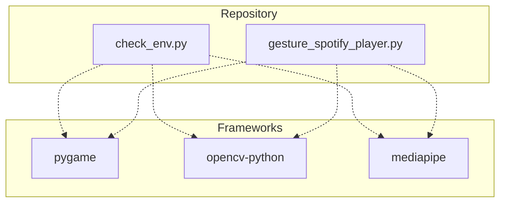

# Architecture Diagram

```mermaid
graph TD
    subgraph Repository
        check_env_py[check_env.py]
        gesture_spotify_player_py[gesture_spotify_player.py]
    end
    subgraph Frameworks
        fw_pygame[pygame]
        fw_opencv_python[opencv-python]
        fw_mediapipe[mediapipe]
    end
    check_env_py -.-> fw_pygame
    check_env_py -.-> fw_opencv_python
    check_env_py -.-> fw_mediapipe
    gesture_spotify_player_py -.-> fw_pygame
    gesture_spotify_player_py -.-> fw_opencv_python
    gesture_spotify_player_py -.-> fw_mediapipe
```