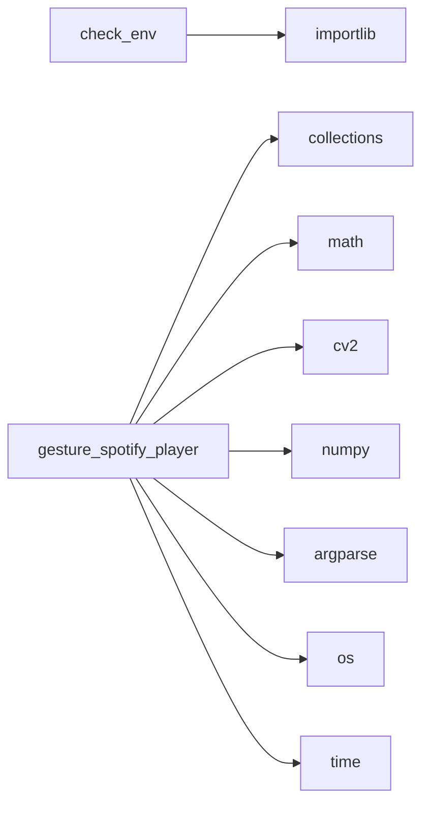

# Dependency Graph

```mermaid
graph LR
    check_env[check_env]
    check_env --> importlib[importlib]
    gesture_spotify_player[gesture_spotify_player]
    gesture_spotify_player --> collections[collections]
    gesture_spotify_player --> math[math]
    gesture_spotify_player --> cv2[cv2]
    gesture_spotify_player --> numpy[numpy]
    gesture_spotify_player --> argparse[argparse]
    gesture_spotify_player --> os[os]
    gesture_spotify_player --> time[time]
    click check_env href "https://github.com/NITISH-R-G/PalmPlay1/blob/main/check_env.py" "View source code"
    click gesture_spotify_player href "https://github.com/NITISH-R-G/PalmPlay1/blob/main/gesture_spotify_player.py" "View source code"
```