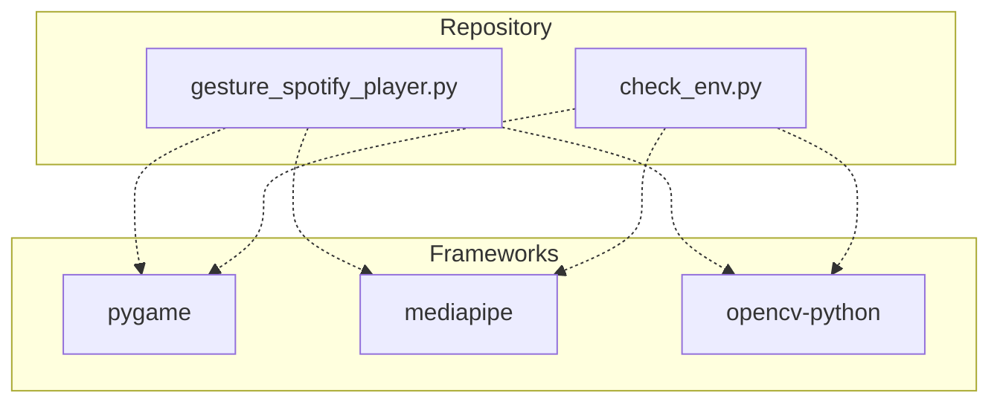
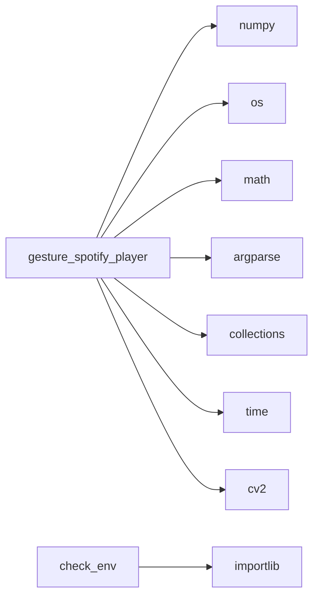

# Autonomous Repository


## Project Overview
This repository is continuously analyzed, documented, and maintained by an automated AI agent and CI/CD pipelines. (AI summarization disabled: no API key).

## Technology Stack
**Frameworks:** pygame, mediapipe, opencv-python
**Python Dependencies:** opencv-python, mediapipe, pycaw, pygame, numpy


## Repository Structure
```text
├── gesture_spotify_player.py
├── .gitignore
├── requirements.txt
├── gestures_spotify_colab.ipynb
├── check_env.py
├── README.md
```

## Environment Variables
The following environment variables were detected in the codebase:
- `SPOTIPY_CLIENT_SECRET`
- `SPOTIPY_CLIENT_ID`
- `SPOTIPY_REDIRECT_URI`


## Setup Instructions
1. Clone the repository
2. Install dependencies: `pip install -r requirements.txt`
3. Configure environment variables.


## Architecture Diagrams
### System Architecture

### Module Dependencies
